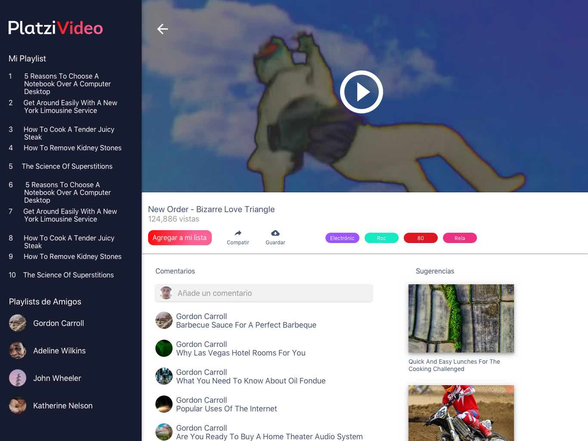
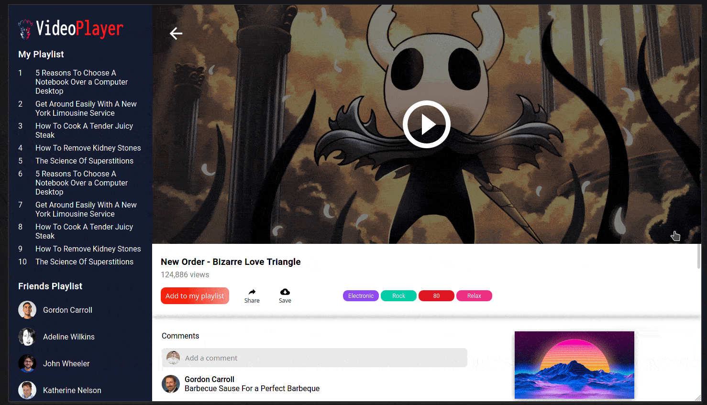
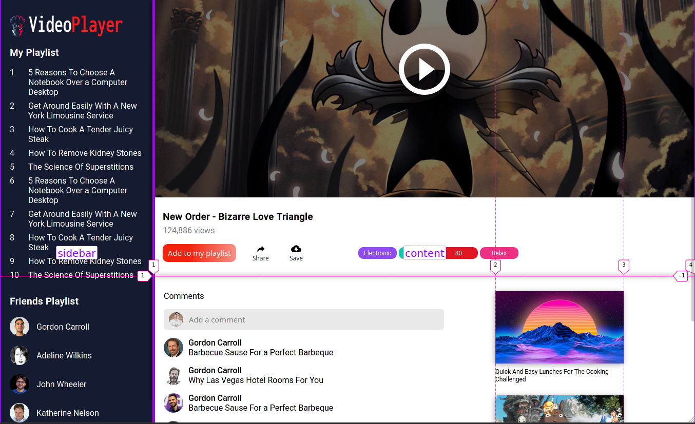

# Videos Player Page

Frontend exercise creating a videos player page using css grid layout.

- Solution: https://videos-player-css-grid.xergioalex.com/

## Challenge

Create a movie page based on the following mockup:


## Solution

This is my solution inspired on the below mockup: https://videos-player-css-grid.xergioalex.com/


Css grid layout areas:


### How to make updates

Run local server:
```
yarn server
```

Run sass watcher:
```
yarn sass:watcher
```

**Optional:** Open the project using vscode docker container.

Run setup script:
```
cd docker/local
bash docker.sh base
```

Reset folder project permissions:
```
chown -R user_id:group_id movies-page-css-grid
```

## :electric_plug: Powered by [XergioAleX](https://www.xergioalex.com/)

<a href="https://www.xergioalex.com/" target="_blank">
  
</a>

## License

This project is [MIT licensed](./LICENSE).
